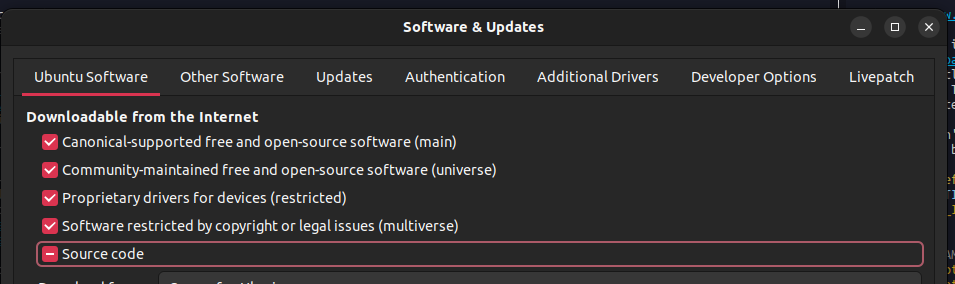

# Bootstrap Ubuntu 22.04

This dotfiles repository is currently aimed for Ubuntu 22.04.

Installation script do following:

  - compile latest [GNU Emacs](https://www.gnu.org/software/emacs/) from
    sources;
  - install:
      - [Git](https://git-scm.com/)
      - [fdfind](https://github.com/sharkdp/fd) (for fast file indexing)
      - [The Silver
        Searcher](https://github.com/ggreer/the_silver_searcher)
        (improves searching and is faster than both grep and ack)
      - tools for [vterm](https://github.com/akermu/emacs-libvterm)
      - [pandoc](https://pandoc.org/installing.html) - Library for
        converting from one markup format to another, including various
        flavors of pdf, org, Markdown, HTML, LaTeX, Word Docx, and many
        others.
      - [gh](https://cli.github.com/manual/) A command-line interface to
        GitHub.
      - [hunspell](http://hunspell.github.io/) A spell checker
      - [w3m](http://w3m.sourceforge.net/) A text-based web browser (for
        rendering emails).
      - [curl](https://curl.se/) A tool for transfering data
      - google-chrome
      - [chrome-session-dump](https://github.com/lemnos/chrome-session-dump)
        A tool for dumping the contents of chrome session files.
      - [nvm](https://github.com/nvm-sh/nvm),
        [nodejs](https://nodejs.org/en/) A JavaScript runtime
      - [flacon](https://help.ubuntu.ru/wiki/flacon)
      - dconf-editor
      - avidemux
      - pass
      - pass-extension-import
  - optionally:
      - Remap capslock to ctrl
      - Set Emacs gtk keyboard theme

## Pre Requirements

Open `Software & Updates` and ensure the Source Code source is enabled
and reload the package list (or run `sudo apt update` in a terminal
after adding Source Code).

## Usage

You can use the convenience script to install the dotfiles on any
machine with a single command. Simply run the following command in your
terminal:

    bash -c "$(wget -qO- https://raw.githubusercontent.com/KarimAziev/dotfiles/main/install.sh)"
